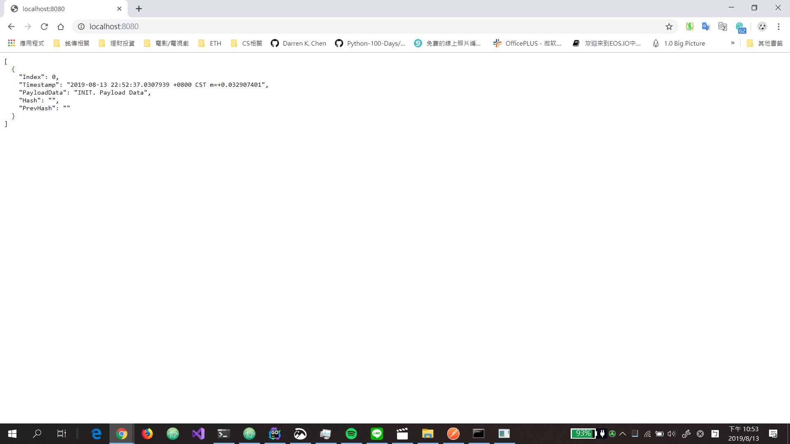
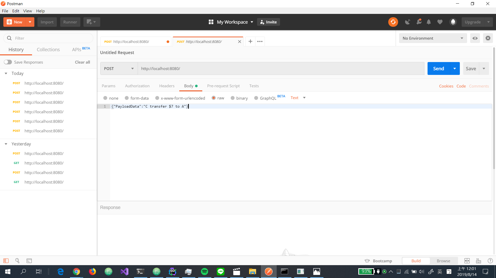
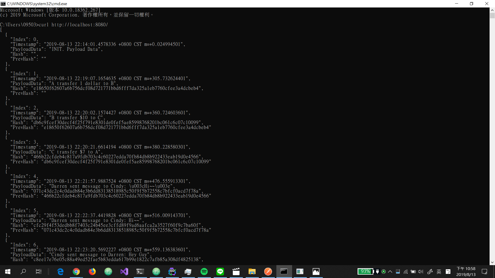

# DarrenChain
Contributor: Darren K.J. Chen

__Windows System:__

You can clone this repo and run <code>main.exe</code> directly.

__All System:__

Since we’re going to run this chain, you should <a href="https://golang.org/dl/">installing</a> and configuring Golang first.

And we’ll also want to grab the following packages:

```shell
go get github.com/davecgh/go-spew/spew
```

```shell
go get github.com/gorilla/mux
```

```shell
go get github.com/joho/godotenv
```

If you all done, type the following commands to run the chain:

```shell
git clone https://github.com/darrenchain/SimpleChain_preview_19.0.git
cd SimpleChain_preview_19.0
```

```shell
go run main.go
```

Now, visit localhost with port 8080. As expected, we see the same genesis block.



For using POST requests, i like to use Postman ( in GUI ) and Curl ( in CLI ).




